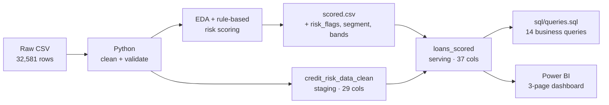

## Credit Risk Analytics — Loan Portfolio Default Analysis              
End-to-end analytics pipeline on a 32,574-loan portfolio: Python cleaning and EDA → SQL Server data layers → Power BI executive dashboard.             
Identifies which borrower segments drive default risk and quantifies the exposure at stake. The insights support data-driven credit risk management, enabling financial institutions to improve lending decisions and mitigate potential credit losses.    
**1. Business Problem**            
A retail lender needs to know where its default risk is concentrated so it can tighten underwriting without shrinking the book more than necessary.       
Three questions drive the analysis:            
- Which loan grades, purposes and borrower profiles default most?
- Is there a debt-to-income threshold where risk changes behaviour?
- Can we define a high-risk segment small enough to act on, but large enough to matter?                  
***Dataset***
- **33,000** consumer loan records
- Markets: United States, Canada, and the United Kingdom                
**2. Business Objective**
- Identify the key factors associated with loan default
- Profile high-risk customer segments
- Support more effective credit approval decisions
- Reduce default risk and improve portfolio quality
### Dashboard   
**Page 1 — Overview**          
                
**Page 2 — Borrower Profile**              

**Page 3 — Risk Segmentation**                

**Page 4 - Characteristics & Pricing**               

| **Resource** | **Description** | **Access** |
|--------------|-----------------|------------|
| Live Dashboard | Interactive Power BI dashboard | [Open](https://app.powerbi.com/view?r=eyJrIjoiYTNlZjliNTQtMjdjMy00ODExLWI0ODgtMDg5MmM0OTI0YTRhIiwidCI6IjVlMTU4ZTJhLTA1OTYtNGE2Yy04ODAxLTM1MDJhZWY0NTYzZiIsImMiOjEwfQ%3D%3D) |
| Dashboard Report | Exported PDF version of the dashboard | [Open](Dashboard/Credit%20Risk%20Dashboard.pdf) |               
**3. Key Findings**
| # | Finding | Number |
|---|---------|--------|
| 1 | **Portfolio baseline** — overall default rate | **21.8%** (7,107 of 32,574 loans) |
| 2 | **Exposure at risk** — defaulted principal vs total | **$77M** of **$312M** |
| 3 | **Grade cliff at C→D** — default rate jumps sharply between grade C and D, not gradually across grades | see Page 1 |
| 4 | **DTI breakpoint at 0.40** — default rate rises slowly below a loan-to-income ratio of 0.40, then steepens above it | see Page 2 |
| 5 | **Debt consolidation is the riskiest purpose** | **28.6%** default rate vs 21.8% baseline |
| 6 | **Concentrated risk segment** — the flagged high-risk segment is a small slice of the book but carries a disproportionate share of losses | **10.4%** of loans → **29.4%** of defaults |
| 7 | **Geography is not a driver** — default rates are statistically flat across US / UK / Canada | see Page 1 |

### Recommendations
- Apply stricter review to applications with **loan-to-income ≥ 0.40**, the point where the risk curve changes slope.   
- Treat **grade D and below** as a separate underwriting track rather than a continuation of the A–C policy.   
- Price **debt-consolidation** loans off their own baseline, not the portfolio average.   
- Do not spend policy effort on country-level segmentation — it carries no signal in this portfolio.    

## 4. Architecture

**Two-layer design.** `credit_risk_data_clean` is the immutable staging table (cleaned, nothing derived). `loans_scored` is the serving table that carries the derived risk columns. Every downstream consumer — SQL queries, Power BI, the notebooks — reads from `loans_scored`, so all three surfaces report identical numbers. Single source of truth.

### Data Note
This project uses a public dataset for demonstration. Figures reflect the dataset, not any real institution. "NOVA BANK" branding in the dashboard is a fictional label used to present the report as a realistic internal deliverable.

---

## Author
**<<Bùi Thu Hằng>>** — Data Analyst, focused on banking and financial services
[LinkedIn](<<[LINK](https://www.linkedin.com/in/buithuhang/)>>) · [Email](mailto:hangbui.bda@gmail.com)
